# Features Folder Structure

This document provides multiple visualizations of the `src/features` folder structure.

## Table of Contents
- [Numbered Outline](#numbered-outline)
- [Tree Diagram](#tree-diagram)
- [Mermaid Diagram](#mermaid-diagram)

---

## Numbered Outline

### 1. infrastructure
- **1.1.** api
  - **1.1.1.** firebase
  - **1.1.2.** root (handlers, middleware, types, utils)
  - **1.1.3.** __tests__
- **1.2.** auth
  - **1.2.1.** root (components, config, hooks, lib, types, utils)
- **1.3.** components
  - **1.3.1.** ui
  - **1.3.2.** root (layout components)
- **1.4.** game
  - **1.4.1.** __tests__
  - **1.4.2.** root (parsers, types, utils)
- **1.5.** hooks
  - **1.5.1.** __tests__
  - **1.5.2.** root (custom hooks)
- **1.6.** lib
  - **1.6.1.** __tests__
  - **1.6.2.** root (utilities, helpers)
- **1.7.** logging
  - **1.7.1.** root (logging utilities)
- **1.8.** monitoring
  - **1.8.1.** root (monitoring utilities)
- **1.9.** utils
  - **1.9.1.** __tests__
  - **1.9.2.** accessibility
  - **1.9.3.** root (utility functions)

### 2. modules
- **2.1.** analytics-group
  - **2.1.1.** analytics
    - **2.1.1.1.** components
    - **2.1.1.2.** hooks
    - **2.1.1.3.** lib
    - **2.1.1.4.** types
    - **2.1.1.5.** utils
  - **2.1.2.** meta
    - **2.1.2.1.** components
    - **2.1.2.2.** hooks
    - **2.1.2.3.** lib
    - **2.1.2.4.** types
- **2.2.** community
  - **2.2.1.** archives
    - **2.2.1.1.** components
    - **2.2.1.2.** hooks
    - **2.2.1.3.** lib
    - **2.2.1.4.** types
  - **2.2.2.** players
    - **2.2.2.1.** components
    - **2.2.2.2.** hooks
    - **2.2.2.3.** lib
    - **2.2.2.4.** types
  - **2.2.3.** standings
    - **2.2.3.1.** components
    - **2.2.3.2.** hooks
    - **2.2.3.3.** lib
    - **2.2.3.4.** types
- **2.3.** content
  - **2.3.1.** blog
    - **2.3.1.1.** components
    - **2.3.1.2.** lib
    - **2.3.1.3.** types
  - **2.3.2.** classes
    - **2.3.2.1.** components
    - **2.3.2.2.** config
    - **2.3.2.3.** data (abilities, items, units)
    - **2.3.2.4.** hooks
    - **2.3.2.5.** utils
  - **2.3.3.** guides
    - **2.3.3.1.** components
    - **2.3.3.2.** lib
    - **2.3.3.3.** types
- **2.4.** game-management
  - **2.4.1.** entries
    - **2.4.1.1.** components
    - **2.4.1.2.** lib
  - **2.4.2.** games
    - **2.4.2.1.** components
    - **2.4.2.2.** hooks
    - **2.4.2.3.** lib
    - **2.4.2.4.** types
  - **2.4.3.** scheduled-games
    - **2.4.3.1.** components
    - **2.4.3.2.** lib
    - **2.4.3.3.** utils
- **2.5.** players
  - **2.5.1.** hooks
- **2.6.** shared
  - **2.6.1.** components
  - **2.6.2.** types
  - **2.6.3.** utils
- **2.7.** tools
  - **2.7.1.** hooks
  - **2.7.2.** types
  - **2.7.3.** utils
- **2.8.** tools-group
  - **2.8.1.** map-analyzer
    - **2.8.1.1.** components
    - **2.8.1.2.** types
    - **2.8.1.3.** utils
  - **2.8.2.** tools
    - **2.8.2.1.** components
    - **2.8.2.2.** hooks
    - **2.8.2.3.** types
    - **2.8.2.4.** utils

---

## Tree Diagram

```
features/
├── infrastructure/
│   ├── api/
│   │   ├── firebase/
│   │   └── __tests__/
│   ├── auth/
│   ├── components/
│   │   └── ui/
│   ├── game/
│   │   └── __tests__/
│   ├── hooks/
│   │   └── __tests__/
│   ├── lib/
│   │   └── __tests__/
│   ├── logging/
│   ├── monitoring/
│   └── utils/
│       ├── accessibility/
│       └── __tests__/
│
└── modules/
    ├── analytics-group/
    │   ├── analytics/
    │   │   ├── components/
    │   │   ├── hooks/
    │   │   ├── lib/
    │   │   ├── types/
    │   │   └── utils/
    │   └── meta/
    │       ├── components/
    │       ├── hooks/
    │       ├── lib/
    │       └── types/
    │
    ├── community/
    │   ├── archives/
    │   │   ├── components/
    │   │   ├── hooks/
    │   │   ├── lib/
    │   │   └── types/
    │   ├── players/
    │   │   ├── components/
    │   │   ├── hooks/
    │   │   ├── lib/
    │   │   └── types/
    │   └── standings/
    │       ├── components/
    │       ├── hooks/
    │       ├── lib/
    │       └── types/
    │
    ├── content/
    │   ├── blog/
    │   │   ├── components/
    │   │   ├── lib/
    │   │   └── types/
    │   ├── classes/
    │   │   ├── components/
    │   │   ├── config/
    │   │   ├── data/
    │   │   │   ├── abilities/
    │   │   │   ├── items/
    │   │   │   └── units/
    │   │   ├── hooks/
    │   │   └── utils/
    │   └── guides/
    │       ├── components/
    │       ├── lib/
    │       └── types/
    │
    ├── game-management/
    │   ├── entries/
    │   │   ├── components/
    │   │   └── lib/
    │   ├── games/
    │   │   ├── components/
    │   │   ├── hooks/
    │   │   ├── lib/
    │   │   └── types/
    │   └── scheduled-games/
    │       ├── components/
    │       ├── lib/
    │       └── utils/
    │
    ├── players/
    │   └── hooks/
    │
    ├── shared/
    │   ├── components/
    │   ├── types/
    │   └── utils/
    │
    ├── tools/
    │   ├── hooks/
    │   ├── types/
    │   └── utils/
    │
    └── tools-group/
        ├── map-analyzer/
        │   ├── components/
        │   ├── types/
        │   └── utils/
        └── tools/
            ├── components/
            ├── hooks/
            ├── types/
            └── utils/
```

---

## Mermaid Diagram

```mermaid
graph TD
    Features["features/"]
    
    %% Infrastructure
    Infra["1. infrastructure"]
    InfraAPI["1.1 api"]
    InfraAPIFirebase["1.1.1 firebase"]
    InfraAPITests["1.1.3 __tests__"]
    InfraAuth["1.2 auth"]
    InfraComponents["1.3 components"]
    InfraComponentsUI["1.3.1 ui"]
    InfraGame["1.4 game"]
    InfraGameTests["1.4.1 __tests__"]
    InfraHooks["1.5 hooks"]
    InfraHooksTests["1.5.1 __tests__"]
    InfraLib["1.6 lib"]
    InfraLibTests["1.6.1 __tests__"]
    InfraLogging["1.7 logging"]
    InfraMonitoring["1.8 monitoring"]
    InfraUtils["1.9 utils"]
    InfraUtilsTests["1.9.1 __tests__"]
    InfraUtilsA11y["1.9.2 accessibility"]
    
    %% Modules
    Modules["2. modules"]
    
    %% Analytics Group
    AnalyticsGroup["2.1 analytics-group"]
    Analytics["2.1.1 analytics"]
    AnalyticsComp["components"]
    AnalyticsHooks["hooks"]
    AnalyticsLib["lib"]
    AnalyticsTypes["types"]
    AnalyticsUtils["utils"]
    Meta["2.1.2 meta"]
    MetaComp["components"]
    MetaHooks["hooks"]
    MetaLib["lib"]
    MetaTypes["types"]
    
    %% Community
    Community["2.2 community"]
    Archives["2.2.1 archives"]
    ArchivesComp["components"]
    ArchivesHooks["hooks"]
    ArchivesLib["lib"]
    ArchivesTypes["types"]
    Players["2.2.2 players"]
    PlayersComp["components"]
    PlayersHooks["hooks"]
    PlayersLib["lib"]
    PlayersTypes["types"]
    Standings["2.2.3 standings"]
    StandingsComp["components"]
    StandingsHooks["hooks"]
    StandingsLib["lib"]
    StandingsTypes["types"]
    
    %% Content
    Content["2.3 content"]
    Blog["2.3.1 blog"]
    BlogComp["components"]
    BlogLib["lib"]
    BlogTypes["types"]
    Classes["2.3.2 classes"]
    ClassesComp["components"]
    ClassesConfig["config"]
    ClassesData["data"]
    ClassesHooks["hooks"]
    ClassesUtils["utils"]
    Guides["2.3.3 guides"]
    GuidesComp["components"]
    GuidesLib["lib"]
    GuidesTypes["types"]
    
    %% Game Management
    GameMgmt["2.4 game-management"]
    Entries["2.4.1 entries"]
    EntriesComp["components"]
    EntriesLib["lib"]
    Games["2.4.2 games"]
    GamesComp["components"]
    GamesHooks["hooks"]
    GamesLib["lib"]
    GamesTypes["types"]
    ScheduledGames["2.4.3 scheduled-games"]
    ScheduledComp["components"]
    ScheduledLib["lib"]
    ScheduledUtils["utils"]
    
    %% Other Modules
    PlayersModule["2.5 players"]
    PlayersModuleHooks["hooks"]
    Shared["2.6 shared"]
    SharedComp["components"]
    SharedTypes["types"]
    SharedUtils["utils"]
    Tools["2.7 tools"]
    ToolsHooks["hooks"]
    ToolsTypes["types"]
    ToolsUtils["utils"]
    ToolsGroup["2.8 tools-group"]
    MapAnalyzer["2.8.1 map-analyzer"]
    MapComp["components"]
    MapTypes["types"]
    MapUtils["utils"]
    ToolsGroupTools["2.8.2 tools"]
    ToolsGroupComp["components"]
    ToolsGroupHooks["hooks"]
    ToolsGroupTypes["types"]
    ToolsGroupUtils["utils"]
    
    %% Connections
    Features --> Infra
    Features --> Modules
    
    Infra --> InfraAPI
    InfraAPI --> InfraAPIFirebase
    InfraAPI --> InfraAPITests
    Infra --> InfraAuth
    Infra --> InfraComponents
    InfraComponents --> InfraComponentsUI
    Infra --> InfraGame
    InfraGame --> InfraGameTests
    Infra --> InfraHooks
    InfraHooks --> InfraHooksTests
    Infra --> InfraLib
    InfraLib --> InfraLibTests
    Infra --> InfraLogging
    Infra --> InfraMonitoring
    Infra --> InfraUtils
    InfraUtils --> InfraUtilsTests
    InfraUtils --> InfraUtilsA11y
    
    Modules --> AnalyticsGroup
    AnalyticsGroup --> Analytics
    Analytics --> AnalyticsComp
    Analytics --> AnalyticsHooks
    Analytics --> AnalyticsLib
    Analytics --> AnalyticsTypes
    Analytics --> AnalyticsUtils
    AnalyticsGroup --> Meta
    Meta --> MetaComp
    Meta --> MetaHooks
    Meta --> MetaLib
    Meta --> MetaTypes
    
    Modules --> Community
    Community --> Archives
    Archives --> ArchivesComp
    Archives --> ArchivesHooks
    Archives --> ArchivesLib
    Archives --> ArchivesTypes
    Community --> Players
    Players --> PlayersComp
    Players --> PlayersHooks
    Players --> PlayersLib
    Players --> PlayersTypes
    Community --> Standings
    Standings --> StandingsComp
    Standings --> StandingsHooks
    Standings --> StandingsLib
    Standings --> StandingsTypes
    
    Modules --> Content
    Content --> Blog
    Blog --> BlogComp
    Blog --> BlogLib
    Blog --> BlogTypes
    Content --> Classes
    Classes --> ClassesComp
    Classes --> ClassesConfig
    Classes --> ClassesData
    Classes --> ClassesHooks
    Classes --> ClassesUtils
    Content --> Guides
    Guides --> GuidesComp
    Guides --> GuidesLib
    Guides --> GuidesTypes
    
    Modules --> GameMgmt
    GameMgmt --> Entries
    Entries --> EntriesComp
    Entries --> EntriesLib
    GameMgmt --> Games
    Games --> GamesComp
    Games --> GamesHooks
    Games --> GamesLib
    Games --> GamesTypes
    GameMgmt --> ScheduledGames
    ScheduledGames --> ScheduledComp
    ScheduledGames --> ScheduledLib
    ScheduledGames --> ScheduledUtils
    
    Modules --> PlayersModule
    PlayersModule --> PlayersModuleHooks
    
    Modules --> Shared
    Shared --> SharedComp
    Shared --> SharedTypes
    Shared --> SharedUtils
    
    Modules --> Tools
    Tools --> ToolsHooks
    Tools --> ToolsTypes
    Tools --> ToolsUtils
    
    Modules --> ToolsGroup
    ToolsGroup --> MapAnalyzer
    MapAnalyzer --> MapComp
    MapAnalyzer --> MapTypes
    MapAnalyzer --> MapUtils
    ToolsGroup --> ToolsGroupTools
    ToolsGroupTools --> ToolsGroupComp
    ToolsGroupTools --> ToolsGroupHooks
    ToolsGroupTools --> ToolsGroupTypes
    ToolsGroupTools --> ToolsGroupUtils
    
    %% Styling
    classDef infraClass fill:#e1f5ff,stroke:#01579b,stroke-width:2px
    classDef moduleClass fill:#f3e5f5,stroke:#4a148c,stroke-width:2px
    classDef subClass fill:#fff3e0,stroke:#e65100,stroke-width:1px
    
    class Infra,InfraAPI,InfraAuth,InfraComponents,InfraGame,InfraHooks,InfraLib,InfraLogging,InfraMonitoring,InfraUtils infraClass
    class Modules,AnalyticsGroup,Community,Content,GameMgmt,PlayersModule,Shared,Tools,ToolsGroup moduleClass
```



---

## Summary Statistics

- **Total top-level categories:** 2 (infrastructure, modules)
- **Infrastructure subdirectories:** 9
- **Module groups:** 8
- **Total feature modules:** 20+
- **Common patterns:**
  - Most modules follow: `components/`, `hooks/`, `lib/`, `types/`, `utils/`
  - Test files in `__tests__/` directories
  - Shared utilities in dedicated folders
